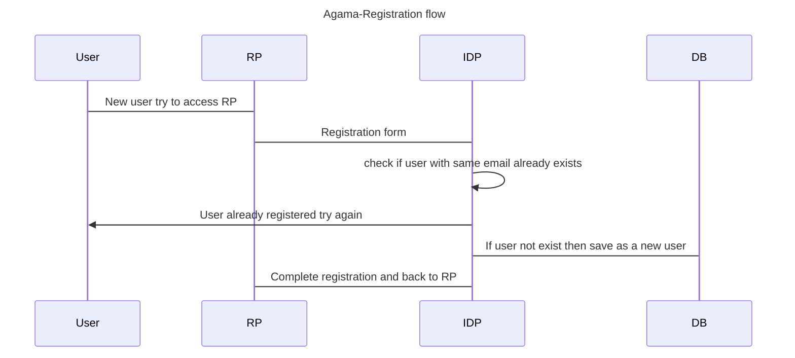

<p>
 
</p>

[![Contributors][contributors-shield]](contributors-url)
[![Forks][forks-shield]](forks-url)
[![Stargazers][stars-shield]](stars-url)
[![Issues][issues-shield]](issues-url)
[![Apache License][license-shield]](license-url)
 
# About Agama-Registration Project

This repository hosts the Gluu Agama-Registration project, which provides a user registration form and authentication functionality. It streamlines the user onboarding process with secure authentication flows.


## Where To Deploy

The project can be deployed to any IAM server that runs an implementation of 
the [Agama Framework](https://docs.jans.io/head/agama/introduction/) like 
[Janssen Server](https://jans.io) and [Gluu Flex](https://gluu.org/flex/).

## How To Deploy

Different IAM servers may provide different methods and 
user interfaces from where an Agama project can be deployed on that server. 
The steps below show how the Agama-Registration project can be deployed on the 
[Janssen Server](https://jans.io). 

Deployment of an Agama project involves three steps

- [Downloading the `.gama` package from project repository](#download-the-project)
- [Adding the `.gama` package to the IAM server](#add-the-project-to-the-server)
- [Configure the project](#configure-the-project)


### Download the Project

> [!TIP]
> Skip this step if you use the Janssen Server TUI tool to 
> configure this project. The TUI tool enables the download and adding of this 
> project directly from the tool, as part of the `community projects` listing. 

The project is bundled as 
[.gama package](https://docs.jans.io/head/agama/gama-format/). 
Visit the `Assets` section of the 
[Releases](https://github.com/GluuFederation/agama-registration/releases) to download 
the `.gama` package.

### Add The Project To The Server

 The Janssen Server provides multiple ways an Agama project can be 
 deployed and configured. Either use the command-line tool, REST API, or a 
 TUI (text-based UI). Refer to 
 [Agama project configuration page](https://docs.jans.io/head/admin/config-guide/auth-server-config/agama-project-configuration/) in the Janssen Server documentation for more 
 details.

### Configure The Project

Agama project accepts configuration parameters in the JSON format. Agama 
project comes with a basic sample configuration file for reference.
 ```
{
  "<main_flow_name>": {
  }
}
 ```

But the Agama-Registration project does not require any configuration parameters.


### Test The Flow

Use any Relying party implementation (like [jans-tarp](https://github.com/JanssenProject/jans/tree/main/demos/jans-tarp)) to send registration request that triggers the flow.

From the incoming registration request, the Janssen Server reads the `ACR` 
parameter value to identify which authentication method should be used. 
To invoke the `org.gluu.agama.registration.main` flow contained in the  Agama-Registration project, 
specify the ACR value as `agama_<qualified-name-of-the-top-level-flow>`, 
i.e  `agama_org.gluu.agama.registration.main`.

**[N.B]** The OpenID client should include the `authorization_challenge` scope.

## Customize and Make It Your Own

Fork this repo to start customizing the Agama-Registration project. It is possible to 
customize the user interface provided by the flow to suit your organization's 
branding guidelines. Or customize the overall flow behavior. Follow the best 
practices and steps listed [here](https://docs.jans.io/head/admin/developer/agama/agama-best-practices/#project-reuse-and-customizations)
to achieve these customizations in the best possible way.
This project can be reused in other Agama projects to create more complex
authentication journeys. To reuse, trigger the 
[org.gluu.agama.registration.main](#orggluuagamaregistrationmain) flow from other Agama projects.

To make it easier to visualize and customize the Agama Project, use
[Agama Lab](https://cloud.gluu.org/agama-lab/login).

## Flows In The Project

List of the flows: 

- [org.gluu.agama.registration.main](#orggluuagamaregistrationmain)

### org.gluu.agama.registration.main

The main flow of this project is [org.gluu.agama.registration.main](./code/org.gluu.agama.registration.main.flow) .
In step one, the user enters their basic information, including `userName`, `displayName`, `firstName`, `lastName`, `email`, and `password`, which the IDP checks to determine if the user is already registered. If the user is not registered, their details are saved in the database, and a success response is returned. A new acknowledgment page is then displayed, and upon clicking "Continue," the flow is completed, redirecting the user to the Relying Party.

# Sequence Diagram

A basic diagram to understand how the `agama-registration` works.



# Demo


https://github.com/user-attachments/assets/faf4b9bd-6541-4db6-b093-9dce4e9284ed


 <!-- This are stats url reference for this repository -->
[contributors-shield]: https://img.shields.io/github/contributors/GluuFederation/agama-registration.svg?style=for-the-badge
[contributors-url]: https://github.com/GluuFederation/agama-registration/graphs/contributors
[forks-shield]: https://img.shields.io/github/forks/GluuFederation/agama-registration.svg?style=for-the-badge
[forks-url]: https://github.com/GluuFederation/agama-registration/network/members
[stars-shield]: https://img.shields.io/github/stars/GluuFederation/agama-registration?style=for-the-badge
[stars-url]: https://github.com/GluuFederation/agama-registration/stargazers
[issues-shield]: https://img.shields.io/github/issues/GluuFederation/agama-registration.svg?style=for-the-badge
[issues-url]: https://github.com/GluuFederation/agama-registration/issues
[license-shield]: https://img.shields.io/github/license/GluuFederation/agama-registration.svg?style=for-the-badge
[license-url]: https://github.com/GluuFederation/agama-registration/blob/main/LICENSE
